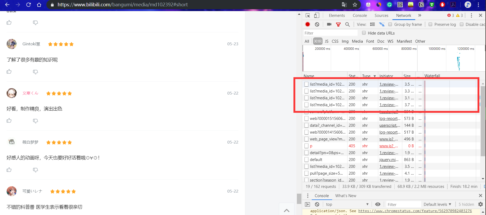
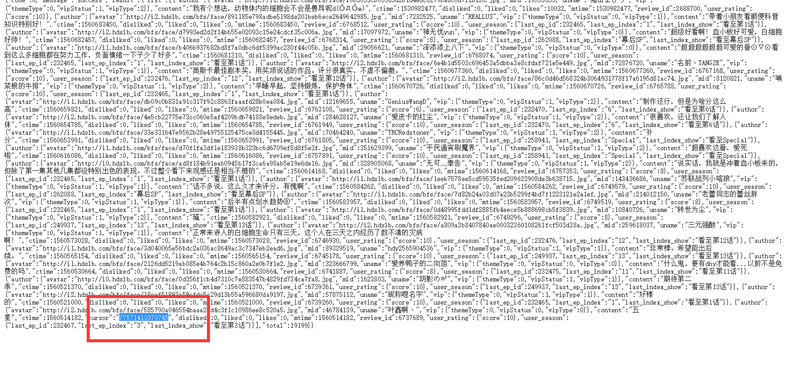
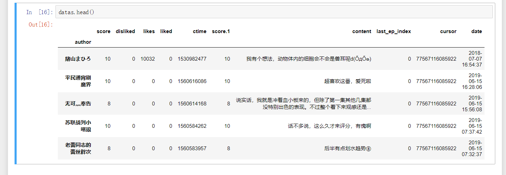
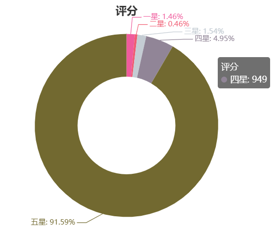
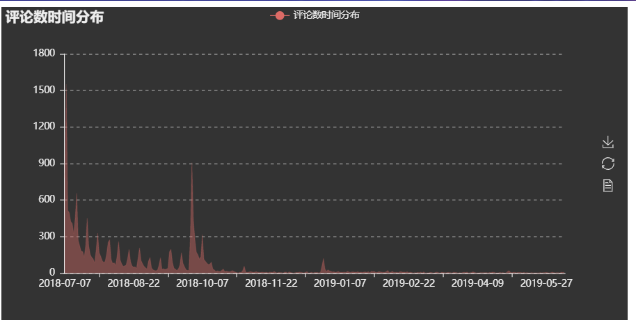
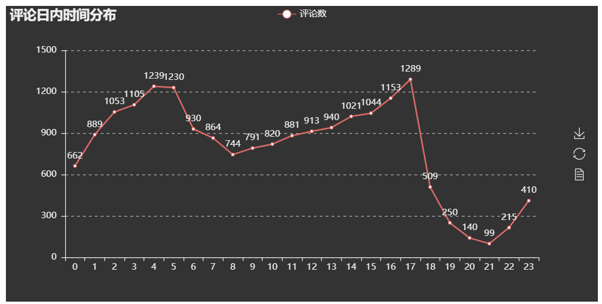
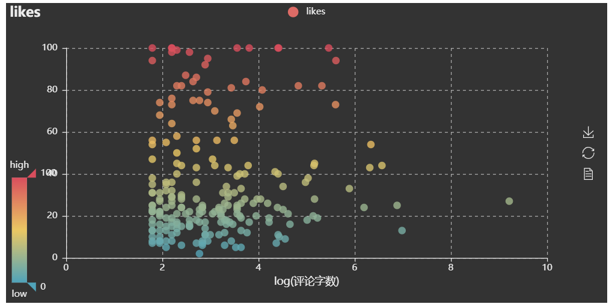
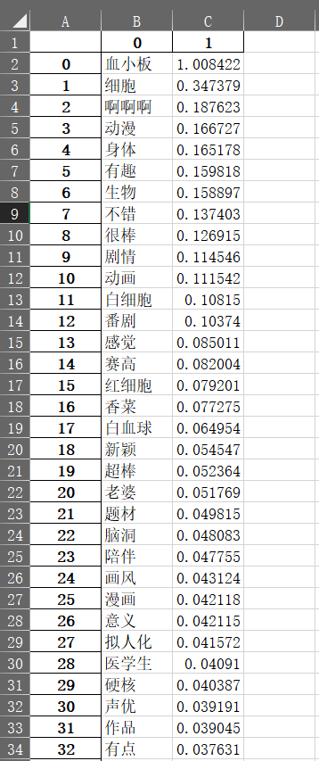

# 动漫《工作细胞》评论分析及Bilibili用户评论爬取  
### 综合实验期末作业  徐子康
## 🔰 爬取

首先爬取Bilibili上，动作细胞番剧下的评论。找到对应Json文件，然后获取Json中的数据。  

点开链接后发现是前20条记录，格式是json且是我们需要的内容。获取接下来20条评论。发现这些json文件的路径存在规律。  


​```
import requests
from fake_useragent import UserAgent
import json
import pandas as pd
import time
import datetime
headers = { "User-Agent": UserAgent(verify_ssl=False).random}
comment_api = 'https://bangumi.bilibili.com/review/web_api/short/list?media_id=102392&folded=0&page_size=20&sort=0'】
​```

所有的json路径的前半部分都是一样，都是再第一条json之后加上不同的cursor = xxx，所以只要找到cursor值得规律，就可以用循环的办法，爬完所有json。最后发现，每一个json路径中cursor值就藏在前一个json的最后一条评论中。  

所以主要思路就是从第一个json开始，爬取完20条评论后，获取最后一个评论中的cursor值，更改如今之后获取第二个json，重复上面的过程，直到爬完所有的json。 
``` 
j = 0
while j <total:
    n = len(json_comment['result']['list'])
    for i in range(n):
        dataall.loc[j,'author'] = json_comment['result']['list'][i]['author']['uname']
        dataall.loc[j,'score'] = json_comment['result']['list'][i]['user_rating']['score']
        dataall.loc[j,'disliked'] = json_comment['result']['list'][i]['disliked']
        dataall.loc[j,'likes'] = json_comment['result']['list'][i]['likes']
        dataall.loc[j,'liked'] = json_comment['result']['list'][i]['liked']
        dataall.loc[j,'ctime'] = json_comment['result']['list'][i]['ctime']
        dataall.loc[j,'content'] = json_comment['result']['list'][i]['content']
        dataall.loc[j,'cursor'] = json_comment['result']['list'][n-1]['cursor'] 
        j+= 1
    try:        
        dataall.loc[j,'last_ep_index'] = json_comment['result']['list'][i]['user_season']['last_ep_index']
    except:
        pass

    comment_api1 = comment_api + '&cursor=' + dataall.loc[j-1,'cursor'] 
    response_comment = requests.get(comment_api1,headers = headers)
    json_comment = response_comment.text
    json_comment = json.loads(json_comment)
    
    if j % 50 ==0:
        print('已完成 {}% !'.format(round(j/total*100,2)))
    time.sleep(0.5)
```

### ✨爬取完后数据预览如下。  

author表示评论发表的用户名，score表示打分，likes表示点赞，ctimes表示时间，content表示评论内容。  

## 🔰 数据分析

### ✨用户评分
一共爬取到了1.9万条评论。首先对用户的打分进行分析。score取值范围为2，4，6，8，10分，分别对应1-5颗星。  

如表所示，几乎所有的用户都给了这部动漫五星好评  

### ✨评论数时间分布

统计了每一天的评论术后，得到了评论数的分布图。可以看到评论主要集中在每一次动漫更新的时间点上。

### ✨一天之内的评论时间分布

除了每日的评论数。通过对用户的评论时间进行统计分析。可以看到中午到晚上具有上升趋势。以及凌晨三点开始评论数上涨。可能可以说明一部分看这个动漫的用户有晚睡的习惯。

### ✨热评字数

同时我还想分析一些，是否点赞多的，一定是写的评论的字数多的。因为大部分评论没有点赞，所以这里只统计了有点赞的。整体看来，字数和点赞数没什么关系。

### ✨评论分析TF-IDF
接下来对评论内容进行分析。看看大家都说了什么？为什么这部剧那么受欢迎。  
通过jieba分词；去除停止词，计算词频和TF-IDF的过程，提取了重要性前500的词。  
  
可以看到，“血小板”高居首位，毕竟大家对于这个重要的角色很是喜欢。词语中也存在一些意义不大的词。不过从这些词云中还是可以看出很多东西。比如题材的选取，动漫的可爱画风。

